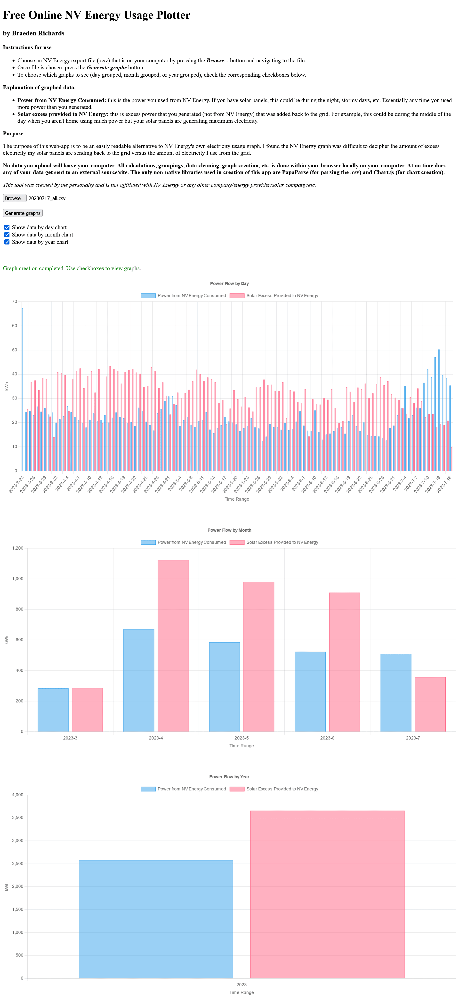

# NV Energy Data Plotter

## Purpose

The purpose of this web-app is to be an easily readable alternative to NV Energy's own electricity usage chart. I found the chart available on NV Energy's dashboard was difficult to read/understand. The NV Energy dashboard uses a stacked column chart that does not present received vs. delivered power flow values in a way the average user can understand.

## Instructions for Use

### To Access

- Via hosted site (formatted/styled)
  - [NV Energy Usage Plotter](https://www.braedenrichards.com/pages/tools/nvenergy-usage-tool/nvenergy-usage-tool)
- Hosting yourself (No formatting/styling)
  - Download/pull this repository. The files in /src/ are the only required files to run
    - An internet connection is required since I am pulling libraries from their hosted sites
  - Run using any serving device of your choice
    - For example, Python's HTTP library
      - `> python -m http.server`

### How to Use

- Choose an NV Energy export file (.csv) that is on your computer by pressing the **_Browse..._** button and navigating to the file
  - An export file is obtained by request on the NV Energy dashboard website
  - After choosing the file, the name of the file should show next to the **_Browse..._** button
- Once the file is chosen, press the **_Generate graphs_** button.
  - On success, text will show stating _Graph creation completed_
- To see/choose the graphs, check the corresponding checkboxes

### Explanation of Graphed Data

- **Power from NV Energy Consumed:** this is the power you used from NV Energy. If you have solar panels, this could be during the night, stormy days, etc. Essentially any time you used more power than you generated.
- **Solar excess provided to NV Energy:** this is excess power that you generated (not from NV Energy) that was added back to the grid. For example, this could be during the middle of the day when you aren't home using much power but your solar panels are generating maximum electricity.
  - This is not the TOTAL energy you generated since that is not measured from NV Energy. This is just the excess you generated.

## Libraries Used

This graphing tool uses:

- [Chart.js](https://www.chartjs.org/) for chart creation
- [PapaParse](https://www.papaparse.com/) for csv parsing

## Disclaimer

_This tool was created by me personally and is not affiliated with NV Energy or any other company/energy provider/solar company/etc._

## Examples of Use

Example of use using the non-formatted/styled tool (via this repo, not from the above provided _tools_ hosted site)

